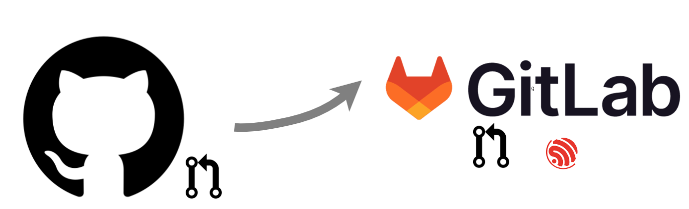

<div align="center">
  <h1>GitHub PR to Gitlab MR Sync (GitHub Action)</h1>
  
  <br>
  <br>
  <!-- GitHub Badges -->
   
   
</div>
GitHub PR to Gitlab MR Sync Action is a solution for one-way synchronization of GitHub PRs into Espressif Gitlab MRs.
<br>
<br>
This script automates the process of creating branches and PRs on the internal codebase of Espressif based on approved PRs on Github.

<hr>

- [Workflow Overview](#workflow-overview)
  - [Workflow File](#workflow-file)
  - [Environment Variables and Secrets Configuration](#environment-variables-and-secrets-configuration)
- [Steps to Sync a PR (by user)](#steps-to-sync-a-pr-by-user)
- [Project Issues](#project-issues)
- [Contributing](#contributing)

## Workflow Overview

This document outlines the steps required to synchronize pull requests (PRs) using a specific GitHub Action. The process ensures the most recent changes are safely merged, rebased, or updated in your project repository.

To use this GitHub Action in your repository, you need to create the following:

- A workflow file
- Issue/PR labels: `PR-Sync-Merge`, `PR-Sync-Rebase`, `PR-Sync-Update`
- Action secrets

### Workflow File

Below is an example of the workflow file:

```yaml
# FILE: .github/workflows/pr_approved.yml

name: Sync approved PRs to internal codebase
on:
  pull_request_target:
    types: [labeled]

jobs:
  sync_prs_to_internal_codebase:
    name: GitHub PR to Internal Codebase Sync
    runs-on: ubuntu-latest
    if: (github.event.label.name == 'PR-Sync-Merge')   ||
        (github.event.label.name == 'PR-Sync-Rebase')  ||
        (github.event.label.name == 'PR-Sync-Update')
    steps:
      - uses: actions/checkout@v4

      - name: Sync approved PRs to internal codebase
        uses: espressif/sync-pr-to-gitlab@v1
        env:
          GITHUB_TOKEN: ${{ secrets.GITHUB_TOKEN }}
          GITLAB_URL: ${{ secrets.GITLAB_URL }}
          GITLAB_TOKEN: ${{ secrets.GITLAB_TOKEN }}
          GIT_CONFIG_NAME: ${{ secrets.GIT_CONFIG_NAME }}
          GIT_CONFIG_EMAIL: ${{ secrets.GIT_CONFIG_EMAIL }}
          JIRA_PROJECT: SOMEPROJECT
```

### Environment Variables and Secrets Configuration

The GitHub PR to GitLab MR Sync workflow requires configuring specific environment variables and secrets to operate effectively.

Below is a detailed table outlining the necessary configurations:

| Variable/Secret    | Description                                                               | Requirement |
| ------------------ | ------------------------------------------------------------------------- | ----------- |
| `GITHUB_TOKEN`     | Automatically provided by GitHub to authorize actions.                    | Inherited   |
| `GITLAB_URL`       | URL of the Espressif GitLab instance for API requests.                    | Mandatory   |
| `GITLAB_TOKEN`     | Access token for creating MRs, comments, and updates in Espressif GitLab. | Mandatory   |
| `GIT_CONFIG_NAME`  | Username for Git commits when syncing, usually a bot name.                | Mandatory   |
| `GIT_CONFIG_EMAIL` | Email for Git commits when syncing, representing the bot email.           | Mandatory   |
| `JIRA_PROJECT`     | The slug of the JIRA project where new issues will be created.            | Mandatory   |

## Steps to Sync a PR (by user)

1. **Initiate Sync**: Once a PR is reviewed and ready to merge, add a comment in the PR's discussion with the format `sha=1a2b3c4`. This comment should include the SHA1 hash (either long or short form) of the **most recent** commit you wish to merge or update. The `sha` acts as a marker for the action to identify the specific commit.

2. **Label the PR**: Apply one of the following labels to the PR to trigger the syncing action:
   - `PR-Sync-Merge`: Merges the PR by creating an internal PR from the GitHub PR branch head to the internal remote, aligning closely with the current default (`master`) branch. This method is preferred for new PRs.
   - `PR-Sync-Rebase`: For older PRs, this label rebases the GitHub PR onto the latest internal master branch.
   - `PR-Sync-Update`: Updates an internal PR with any new commits or changes on the PR's fork branch. To re-trigger the update workflow after its initial run, remove and then reapply the `PR-Sync-Update` label.

> **Note**: Only contributors with access levels higher than [TRIAGE](https://docs.github.com/en/organizations/managing-access-to-your-organizations-repositories/repository-permission-levels-for-an-organization#permission-levels-for-repositories-owned-by-an-organization) can apply these labels on GitHub.

---

## Project Issues

If you encounter any issues, feel free to report them in the project's issues or create Pull Request with your suggestion.

## Contributing

📘 If you are interested in contributing to this project, see the [project Contributing Guide](CONTRIBUTING.md).
